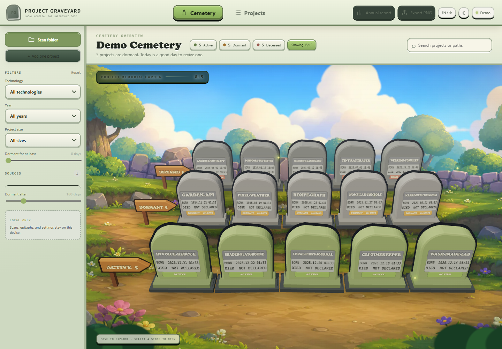
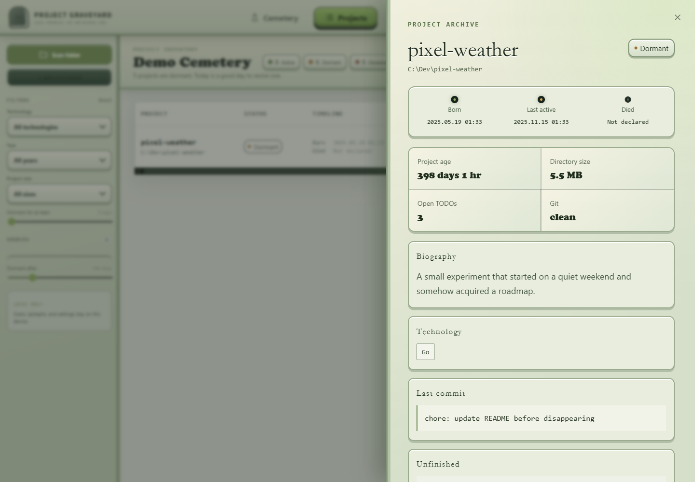

# Project Graveyard

**English** | [简体中文](README.zh-CN.md)

> Give unfinished projects a dignified ending.

Project Graveyard is a completely offline desktop memorial for abandoned software projects. It scans only folders you explicitly select, identifies projects that have gone quiet, and lets you document a funeral, cause of death, and epitaph. A project can always be revived later.



## Highlights

- Detects Git, Node.js, Python, Rust, Go, Maven/Gradle, CMake, and Composer projects.
- Supports recursive folder scans and adding one project directory directly.
- Runs read-only scans in the background with progress, cancellation, and per-project error recovery.
- Shows birth time, last activity, dormant days, size, TODO/FIXME count, Git state, and last commit.
- Filters by status, year, technology, size, and dormant duration.
- Provides a Three.js cemetery and a detailed project inventory view.
- Arranges active, dormant, and deceased projects in separate rows, with up to five graves per row.
- Includes day/night themes and instant Chinese/English UI switching.
- Supports funerals, epitaphs, revival, archive moves, and safe moves to the system recycle bin.
- Exports the cemetery as PNG and generates annual reports.
- Includes 15 demo projects for screenshots and product tours without touching real folders.



## Install

### Windows 10/11

Download `Project-Graveyard-<version>-x64.exe` from [GitHub Releases](https://github.com/zhouder/Project-Graveyard/releases) and run the installer.

To run from source:

```powershell
git clone https://github.com/zhouder/Project-Graveyard.git
cd Project-Graveyard
npm ci
npm run dev
```

Node.js 22 LTS and Git are recommended. Projects without Git history can still be scanned.

## How It Works

1. Choose **Scan folder** to recursively discover supported projects, or **Add one project** for a single directory.
2. Wait for the read-only background scan, or cancel it at any time.
3. Adjust the dormant threshold and filters.
4. Open a dormant project and choose **Hold funeral**.
5. Confirm or edit the death time, then enter a cause and epitaph.
6. Open the archive later to revive, archive, or move the project to the recycle bin.

Scanning never marks a project as deceased automatically. Death always requires explicit user confirmation.

Adding a scan source appends to existing sources. Rescanning refreshes the current index without removing funeral, revival, or migration history.

## Date Rules

- Birth time prefers the first Git commit.
- Without Git history, the earliest creation time of a project marker such as `package.json`, `pyproject.toml`, or `Cargo.toml` is used.
- Last activity uses the later value of meaningful file modification time and the latest Git commit.
- The funeral suggests the last activity time as the death time, precise to the minute.
- The user must confirm or edit the death time, and it cannot precede the last activity.
- Lifespan is calculated from birth time to confirmed death time.

## Privacy and Safety

Project Graveyard has no account, server, telemetry, analytics, domain dependency, or AI API.

- Paths, filenames, code, epitaphs, and statistics never leave the device.
- Scan roots can only be granted through the native folder picker.
- Scans ignore `.git`, `node_modules`, `dist`, `build`, `target`, `venv`, caches, and IDE folders.
- Scanning never modifies project files.
- Local state is stored in an atomic JSON file at `%APPDATA%\project-graveyard\graveyard.json` on Windows.
- A funeral changes local metadata only; it does not move or delete files.
- Archive and recycle-bin operations require clear confirmation.
- Recycle-bin failure never falls back to permanent deletion.

Important projects should still be protected with Git or another backup system.

## Web and Desktop Builds

The React renderer can run in a browser for the full 3D demo:

```powershell
npm run web:dev
```

The browser build cannot reliably inspect arbitrary local Git repositories, move folders, or call the system recycle bin. The Electron desktop build is required for those capabilities.

## Development

```powershell
npm install          # Install dependencies
npm run dev          # Vite + Electron development mode
npm run web:dev      # Browser-only demo
npm run web:build    # Build the browser renderer
npm test             # Run Vitest tests
npm run test:watch   # Run tests in watch mode
npm run lint         # Run ESLint with zero warnings
npm run typecheck    # Check renderer and Electron types
npm run build        # Build production files
```

Main directories:

```text
electron/            Electron main process, preload, scanner, and local storage
src/                 React UI, Three.js cemetery, domain logic, and demo data
public/assets/       Offline visual assets
docs/                Product screenshots
.github/workflows/   GitHub release automation
```

## Package and Release

Build the Windows NSIS installer:

```powershell
npm run dist:win
```

Artifacts are written to `release/`. Pushing a `v*` tag triggers the GitHub Actions release workflow, which runs tests, lint, build, and Windows packaging before attaching the installer to a GitHub Release.

```powershell
git tag v0.1.0
git push origin v0.1.0
```

Electron and Chromium account for most of the installer size. A substantially smaller installer would require a runtime migration such as Tauri with WebView2.

## License

[MIT](LICENSE)
