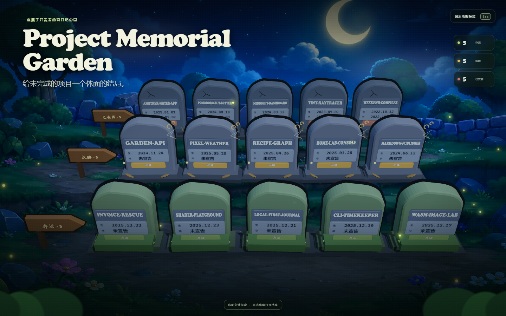
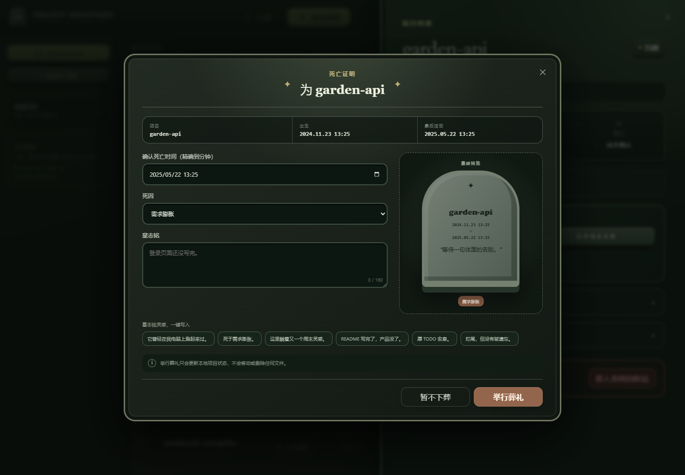

# Project Graveyard

[English](README.md) | **简体中文**

> 给未完成的项目一个体面的结局。

Project Graveyard 是一座完全离线的开发者项目公墓。它只扫描你通过系统目录选择器明确授权的目录，找出长期没有维护的项目；你可以为项目举行葬礼、记录死因和墓志铭，也可以在未来把它复活。



## 主要功能

- 识别 Git、Node.js、Python、Rust、Go、Maven/Gradle、CMake 和 Composer 项目。
- 支持递归扫描文件夹，也可以直接添加单个项目目录。
- 后台只读扫描，显示进度，支持取消和单项目错误恢复。
- 展示出生时间、最后活动、沉睡天数、目录大小、TODO/FIXME、Git 状态和最后提交。
- 按状态、年份、技术栈、大小和沉睡时间筛选。
- 提供 Three.js 立体公墓和项目列表两种视图。
- 提供全屏电影模式，适合 README 截图、Demo GIF 和发布展示。
- 存活、沉睡和死亡项目拥有不同轮廓与场景装饰，不再只依赖颜色区分。
- 存活、沉睡和死亡项目各自成排，每排最多五块墓碑。
- 支持白天/黑夜主题与中英文即时切换。
- 葬礼采用死亡证明式流程，支持实时墓碑预览和双语墓志铭推荐。
- 默认保持侧栏简洁，筛选、来源和沉睡判定收纳在高级控制中。
- 支持复活、迁移归档和安全移入系统回收站。
- 支持导出公墓 PNG 和生成年度报告。
- 内置 15 个演示项目，无需访问真实目录即可录制截图或产品演示。



## 下载

### Windows 10/11

请从 [GitHub Releases](https://github.com/zhouder/Project-Graveyard/releases) 下载最新 Windows 版本。Windows 用户应选择版本号最新的 x64 安装包，例如：

`Project-Graveyard-0.1.1-x64.exe`

合并到 `main` 的改动不会自动发布为桌面安装包。只有推送与应用版本匹配的 `v*` 标签（例如 `v0.1.1`）才会发布新版安装包。

### 从源码运行

也可以从源码运行：

```powershell
git clone https://github.com/zhouder/Project-Graveyard.git
cd Project-Graveyard
npm ci
npm run dev
```

建议使用 Node.js 22 LTS 和 Git。没有 Git 历史的项目仍然可以扫描。

## 使用方法

1. 选择“批量扫描文件夹”递归发现项目，或者选择“添加单个项目”。
2. 等待只读后台扫描完成；扫描过程中可以随时取消。
3. 调整沉睡阈值和筛选条件。
4. 打开一个沉睡项目并选择“举行葬礼”。
5. 确认或修改死亡时间，然后填写死因和墓志铭。
6. 将来可以从项目档案中复活、迁移归档或移入系统回收站。

扫描不会自动把项目判定为死亡。死亡状态必须由用户明确确认。

新增扫描来源不会覆盖已有来源。重新扫描会刷新当前项目索引，同时保留葬礼、复活和迁移历史。

## 日期规则

- 出生时间优先使用第一次 Git commit。
- 没有 Git 历史时，使用 `package.json`、`pyproject.toml`、`Cargo.toml` 等项目标志文件的最早创建时间。
- 最后活动时间取有效文件修改时间和最后 Git commit 中较晚的值。
- 葬礼默认建议最后活动时间作为死亡时间，精确到分钟。
- 死亡时间必须由用户确认或修改，且不能早于最后活动时间。
- 享年等于确认死亡时间减去出生时间。

## 隐私与安全

Project Graveyard 没有账号、服务器、遥测、分析、域名依赖或 AI API。

- 路径、文件名、代码、墓志铭和统计数据不会离开本机。
- 扫描根目录只能通过系统原生目录选择器授权。
- 扫描忽略 `.git`、`node_modules`、`dist`、`build`、`target`、`venv`、缓存和 IDE 目录。
- 扫描过程不会修改项目文件。
- 本地状态使用原子写入 JSON；Windows 默认位置为 `%APPDATA%\project-graveyard\graveyard.json`。
- “举行葬礼”只修改本地状态，不会移动或删除文件。
- 归档和回收站操作都需要清晰确认。
- 回收站操作失败时绝不会降级为永久删除。

重要项目仍然建议使用 Git 或其他备份方式保护。

## 网页版与桌面版

React 渲染层可以直接在浏览器中运行完整 3D 演示：

```powershell
npm run web:dev
```

普通网页无法可靠读取任意本地 Git 仓库、移动目录或调用系统回收站。因此真实项目扫描和文件操作仍然需要 Electron 桌面版。

## 开发命令

```powershell
npm install          # 安装依赖
npm run dev          # Vite + Electron 开发模式
npm run web:dev      # 仅浏览器演示
npm run web:build    # 构建浏览器渲染层
npm test             # 运行 Vitest 测试
npm run test:watch   # 监听测试
npm run lint         # 运行 ESLint，禁止警告
npm run typecheck    # 检查渲染层和 Electron 类型
npm run build        # 构建生产文件
```

主要目录：

```text
electron/            Electron 主进程、preload、扫描器和本地存储
src/                 React UI、Three.js 公墓、领域逻辑和演示数据
public/assets/       完全离线的视觉资源
docs/                产品截图
.github/workflows/   GitHub Release 自动化
```

## 打包与发布

生成 Windows NSIS 安装包：

```powershell
npm run dist:win
```

产物写入 `release/`。推送与 `package.json` 版本一致的 `v*` 标签会触发正式 GitHub Release 构建；工作流会依次执行测试、lint、构建和 Windows 打包，再把带版本号的安装包附加到 Release。

也可以从 `main` 手动运行工作流。手动运行只上传用于验证的临时 Actions artifact，不会创建或覆盖 GitHub Release。

```powershell
git tag v0.1.1
git push origin v0.1.1
```

正式发布前请检查[发布清单](docs/release.md)。

安装包体积主要来自 Electron 和 Chromium。若需要显著缩小，需要后续迁移到 Tauri + WebView2 等桌面运行时。

## 许可证

[MIT](LICENSE)
